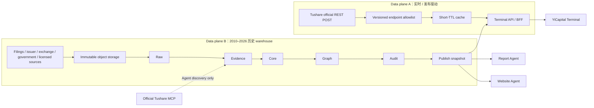
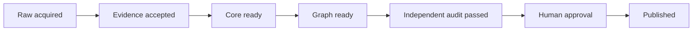

# YiCapital Terminal / Atlas 数据与 Agent 架构

文档状态：`production architecture baseline`

版本：`terminal-atlas-data-1.0`

基准日期：`2026-07-30`

首个试点：`AI compute supply chain`

长期目标：按明确的市值阈值覆盖上市公司，同时保留私营公司、设施、土地、
建筑、能源和终端需求等上下文节点。

## 0. 结论

YiCapital Terminal 是总产品，Atlas 是其中的 Supply Chain / Industry Graph
模块。正确实现方式不是维持一个永不结束的 Agent 对话，也不是让多个 Agent
直接互相“看数据库里有没有东西”后随意写入，而是：

1. 用两个隔离的数据平面分别处理实时/发布驱动数据和 2010–2026 历史数据；
2. 用持久化 coverage queue 把无限项目拆成有界、可重试、幂等的
   subject-period-stage 任务；
3. 对同一个工作分片严格执行
   `Raw → Evidence → Core → Graph → Audit → Publish`；
4. 对互不重叠的公司、年份、数据域和来源并行执行；
5. 只允许网站读取通过门禁的不可变 snapshot；失败时继续服务上一版；
6. 把 Codex Agent 当作可替换的 worker，把 PostgreSQL、对象存储和任务回执
   当作长期记忆与事实来源。

因此，这是“分片内串行、分片间并行”的 DAG，而不是一条全球串行队列，也不是
一个 Agent 的无限循环。

---

## 1. 产品边界

### 1.1 Terminal

Terminal 是统一的研究工作台，当前前端注册了七个 workspace：

- `Market`
- `Stocks`
- `Debt`
- `Supply`
- `ETF`
- `Derivatives`
- `Money & Currency`

Terminal 负责全局搜索、标准年度选择、行情/新闻、证券详情、财务分析、Atlas
可视化、数据状态和证据入口。

### 1.2 Atlas

Atlas 是 Terminal 中的产业链和经济关系图，不是另一套相互独立的公司主数据。
它提供：

- 从能源、土地、建筑、机架、冷却、存储和材料，到制造、封测、服务器、
  数据中心、云、模型和 AI 应用的左右产业链；
- 跨行业集群的“星云”网络；
- 搜索公司后的 upstream、ToB、direct ToC、产品、设施和一跳/两跳 X-Ray；
- 每年一版的关系、金额状态、会计流和证据；
- 披露值、确定性推导、估算、推断、只有关系而无金额、未知值之间的明确区分。

底层必须是带类型、时间和证据的有向多重图。左右产业链只是其中一个 DAG
projection，不能把投资、竞争、许可、双向采购等循环关系强行塞进 Sankey。

### 1.3 下游研报和网站优化

研报 Agent 和 Website Agent 都只能消费已发布的 snapshot：

- Report Agent 可以基于固定 `snapshot_id` 和 Evidence locator 起草研报；
- Website Agent 可以改前端代码、交互和渲染，并运行测试；
- 两者都不能反向修改 Raw、Evidence、Core 或 Graph 的事实；
- 数据更新通过新 snapshot 生效，不应要求每次重新部署网站；
- 网站代码发布仍需独立的构建、浏览器、视觉和线上验证。

---

## 2. 当前代码状态：哪些已经接线，哪些只是设计

本节是事实边界。出现了 schema、菜单、seed 或测试，不等于已经完成全球回填，
也不等于已经在线运行。

| 能力 | 当前实际对象 | 当前状态 | 不能据此声称 |
|---|---|---|---|
| Terminal 页面 | `terminal.html`、`cn/terminal.html`、`en/terminal.html` | 三语 shell 和七个 workspace 已存在 | 七个 workspace 都已有完整数据 |
| Terminal 前端 | `assets/yc-terminal-v2.js`、`assets/terminal-v2.css` | 菜单、搜索、图、X-Ray、FA 与状态 UI 已注册 | 每个菜单对应的生产 API 都已端到端验证 |
| Atlas 发布 seed | `assets/data/atlas-seed.json` | 版本化、显式 `partial` 的 KV 发布源与公开审计工件；浏览器不直接读取 | 已完成 2010–2026 或全部阈值公司 |
| Atlas Worker bridge | `worker/warehouse.js` | 只读 `YC_KV` 快照，缺失/partial 不转成 0 | 已连接 PostgreSQL warehouse |
| Tushare adapter | `worker/tushare.js` | 官方 REST POST、52 个 core endpoint 加 5 个跨市场扩展（当前合计 57）、KV TTL、类型化错误 | Tushare 已有所有 endpoint 权限或能替代产业链证据库 |
| Worker 路由 | `worker/worker.js` | 已注入 Tushare handler 与 KV warehouse adapter | 代码存在等于生产部署和 live QA 已通过 |
| 定时预热 | `worker/worker.js` + `wrangler.toml` | 两个既有 cron 会并行预热 `index_daily`、`index_global`、`shibor`、`news` | 已有无人值守历史回填 Agent |
| 当前绑定 | `YC_KV`、`FEEDBACK_DB` | `YC_KV` 被现有 Worker 使用；`FEEDBACK_DB` 仍是反馈 D1 | D1 是 Atlas 历史数据库 |
| 历史 warehouse | companion migration package 中的 `db/schema.sql`、`0002_financial_filing_p0.sql`、`0003_multi_asset_warehouse.sql` | PostgreSQL 合同和测试工件已设计 | migration 已在生产 PostgreSQL 执行 |
| Agent prompts | companion Atlas package 的 `tasks/00-orchestrator.md` 至 `tasks/60-website.md` | 有界任务模板已设计 | recurring Codex automation 已安装或正在运行 |

### 2.1 当前公开 seed 的真实覆盖

`assets/data/atlas-seed.json` 当前写明：

- `snapshotId = ai-compute-2025-prototype-v1`
- `status = partial`
- seed scope 是 canonical year `2010–2025`，不是生产 warehouse 的
  `2010–2026`
- `marketCapThresholdUsd = 10,000,000,000`
- `marketCapThresholdAsOf = null`
- `universeStatus = candidate-universe-requires-point-in-time-market-cap-check`
- 25 个 entity、23 条 relationship、9 条直接披露关系
- 仅 NVIDIA 的 2024、2025 两个 company-year 财务样本
- `publicationMode = candidate-only`

这些数字是 seed metadata，不是 live queue 状态，也不能证明 USD 10bn universe
已经核验。尤其 `marketCapThresholdAsOf = null` 表示市值分母尚未冻结。

### 2.2 当前 KV bridge

`worker/warehouse.js` 的实际只读 key 是：

```text
terminal:warehouse:atlas-seed
```

公开方法是：

```text
bootstrap
search
market
stockDetail
status
```

它只接受 `schemaVersion = atlas-seed-v1`，保留 `partial` warning，并在快照缺失、
schema 错误或存储未配置时 fail closed。它不是写入管线，也不是长期 warehouse。

### 2.3 当前 API 路由

`worker/worker.js` 在既有 Portal router 前调用：

```js
handleTushareTerminalRequest(request, env, {
  warehouse: createTerminalWarehouseAdapter(env),
})
```

当前公开的 Terminal API 合同是八个 GET route：

```text
/api/terminal/bootstrap
/api/terminal/search
/api/terminal/market
/api/terminal/news
/api/terminal/quote
/api/terminal/history
/api/terminal/stock-detail
/api/terminal/status
```

当前页面路由是：

```text
/terminal
/cn/terminal
/en/terminal
```

Atlas 当前是同一个 Terminal 页面内的 `Supply` workspace，状态通过 query
parameters 表达，例如：

```text
/terminal?workspace=supply&function=network&year=2025&entity=nvda
```

当前 Supply 可视化通过 `/api/terminal/market?domain=Supply` 读取
`YC_KV:terminal:warehouse:atlas-seed`；`assets/data/atlas-seed.json` 是待发布到
KV 的版本化 seed 和公开审计工件，不再是浏览器运行时事实入口。当前运行时事实
入口已统一到 Worker bridge，但它仍是 KV prototype，并非 PostgreSQL
warehouse。端到端 contract test 必须继续证明浏览器 request builder、Worker
route allowlist 和返回 envelope 完全一致。

### 2.4 当前 cron

`wrangler.toml` 当前只有：

```text
30 21 * * *
0 9 * * *
```

两个触发器都会调用 `refreshTushareTerminalSnapshots()`，并行预热：

```text
index_daily
index_global
shibor
news
```

每个 dataset 独立结算；一个权限失败不会抹掉另一个有效结果。这只是行情缓存预热，
不是 Evidence/Core/Graph backfill scheduler。

---

## 3. 目标总架构



### 3.1 部署边界

建议生产拆分为：

- Managed PostgreSQL：实体、期间、事实、关系、任务、lease、coverage、QA 和
  publish metadata；
- Cloudflare R2 或同类对象存储：不可变原始文件、提取片段、graph snapshot、
  LOD tile、manifest 和内容 hash；
- KV：短 TTL 行情 cache、小型搜索 cache、health state 和当前 manifest pointer；
- Cloudflare Worker：认证、CORS、rate limit、API envelope、短查询和 manifest
  serving；
- 独立 Atlas service / Agent runners：历史采集、标准化、图构建和审计；
- 可选 graph serving index：从已批准的 PostgreSQL snapshot 派生，不能成为
  第二事实源。

不要继续把全部长期回填逻辑塞进当前单个 Portal Worker。`FEEDBACK_DB` 保持反馈
用途，不承载 Atlas warehouse。

---

## 4. 两个数据平面

### 4.1 Data plane A：Tushare 实时与发布驱动数据

用途：

- 实时/盘中 snapshot；
- 日线和收盘后数据；
- 新闻与公告增量；
- 宏观发布；
- 证券、基金、债券、期货、期权、外汇等 reference/market data。

当前实现：

- 固定上游：`https://api.tushare.pro`
- 方法：HTTPS `POST`
- body：`api_name`、server-side `token`、`params`、`fields`
- secret：只从 `env.TUSHARE_TOKEN` 读取
- cache：`env.TUSHARE_CACHE || env.YC_KV`
- 默认 timeout：8 秒，可配置范围 10 ms–30 s
- 浏览器不能提交 `token` 或任意 `api_name`

Tushare 官方 HTTP 文档定义了上述 POST contract，并明确返回码 `2002` 表示权限
问题：

- [Tushare HTTP API](https://tushare.pro/document/1?doc_id=130)

这个平面不承担以下职责：

- 不作为产业链 relationship 的默认证据源；
- 不把实时 cache 自动升级为历史事实；
- 不替代监管文件、公司财报和原始披露；
- 不在某个 endpoint 无权限时生成替代数字；
- 不负责跨公司 canonical-year 会计标准化。

#### 4.1.1 七种 freshness class

当前 `worker/tushare.js` 定义：

| Class | 语义 | 当前典型 TTL |
|---|---|---:|
| `static` | 基础资料、日历、合约定义 | 24h |
| `disclosure` | 财报、公告、发行、赎回 | 5m–6h |
| `macro_release` | 利率、货币和宏观发布 | 1h–6h |
| `eod` | 日频行情和指标 | 15m–6h |
| `news_incremental` | 新闻增量 | 1m–5m |
| `intraday_snapshot` | 盘中快照 | 1m |
| `live_minute_bar` | 实时分钟线 | 1m |

Freshness class 和 TTL 是缓存策略，不是“数据必然最新”的承诺。每个 response
还必须携带 `fetched_at`、`retrieved_at`、`as_of`、`is_complete`、`warnings`
和 `cache_status`。

#### 4.1.2 52 个 core endpoint 与当前 5 个扩展

最初的 production adapter contract 是 52 个 endpoint。当前工作树又明确加入了
5 个跨市场 endpoint：

```text
index_global
hk_basic
hk_daily
us_basic
us_daily
```

因此，本基准日期读取到的实际 allowlist 是 57 个。部署状态页应以
`/api/terminal/status` 返回的 `endpoint_count` 为准；每次增加或删除 endpoint
都要版本化并更新 contract tests，不能让文档数字与代码静默漂移。

当前 allowlist 按数据域分布：

| Domain | 数量 | Endpoint |
|---|---:|---|
| Market | 6 | `trade_cal`, `index_basic`, `index_daily`, `index_dailybasic`, `index_global`, `rt_idx_k` |
| Stocks | 17 | `stock_basic`, `daily`, `daily_basic`, `adj_factor`, `income`, `balancesheet`, `cashflow`, `fina_indicator`, `forecast`, `express`, `disclosure_date`, `rt_k`, `rt_min`, `hk_basic`, `hk_daily`, `us_basic`, `us_daily` |
| Debt | 6 | `cb_basic`, `cb_issue`, `cb_daily`, `cb_redeem`, `repo_daily`, `yc_cb` |
| ETF | 7 | `etf_basic`, `fund_basic`, `fund_daily`, `fund_adj`, `etf_share_size`, `rt_etf_k`, `rt_etf_min` |
| Derivatives | 8 | `fut_basic`, `fut_daily`, `fut_mapping`, `fut_wsr`, `fut_holding`, `opt_basic`, `opt_daily`, `rt_fut_min` |
| Money & Currency | 10 | `fx_obasic`, `fx_daily`, `shibor`, `shibor_quote`, `shibor_lpr`, `libor`, `hibor`, `cn_m`, `sf_month`, `us_tycr` |
| News | 3 | `news`, `major_news`, `anns_d` |
| **Total** | **57** | 52 个 core + 5 个跨市场扩展；Supply 不在 Tushare allowlist |

每个 endpoint 还拥有独立 parameter allowlist、最大行数和 freshness class。
其中 `income`、`balancesheet`、`cashflow`、`fina_indicator`、`forecast`、
`express`、`disclosure_date` 只保留给受控 ingestion/reconciliation；公开
`/api/terminal/market` 会在上游 fetch 前拒绝它们。浏览器 FA 只能读取
filing warehouse 发布层，不能直接混入 Tushare 财务历史。

浏览器不能选择任意上游 endpoint。新增 endpoint 必须同时完成：

1. 官方文档和 license/entitlement 核对；
2. endpoint 与 parameter allowlist；
3. schema fixture；
4. pagination/row-limit 策略；
5. freshness、cache 和 `as_of` 规则；
6. 权限失败、空数据、timeout、异常 schema 的 negative tests；
7. 数据域和前端功能映射；
8. secret-leak test。

#### 4.1.3 权限和失败策略

| 条件 | 当前公共错误 | HTTP | 行为 |
|---|---|---:|---|
| endpoint 不在 allowlist | `ENDPOINT_NOT_ALLOWED` | 400 | fetch 前拒绝 |
| 参数不在 allowlist | `PARAM_NOT_ALLOWED` / `QUERY_PARAMETER_NOT_ALLOWED` | 400 | fetch 前拒绝 |
| query 携带 token/api_name | `SENSITIVE_QUERY_REJECTED` | 400 | fetch 前拒绝 |
| Tushare code `2002` 或权限语义 | `TUSHARE_PERMISSION_DENIED` | 403 | 不降级、不伪造 |
| token 缺失 | `TUSHARE_NOT_CONFIGURED` | 503 | fail closed |
| token/auth 失败 | `TUSHARE_AUTH_FAILED` | 503 | 不返回上游正文 |
| timeout | `TUSHARE_TIMEOUT` | 504 | 不使用过期值冒充最新 |
| HTTP/JSON/schema 异常 | typed 502 error | 502 | 不渲染替代值 |
| 有效响应但空数据 | `NO_DATA` | 404 | 不用样本或 0 填充 |
| 达到 endpoint row limit | `row_limit_reached` | 200 + incomplete | `is_complete=false` |

达到 row limit 不是成功完成历史回填。生产 ETL 必须继续分页/分日期窗口，直到
coverage receipt 证明范围完整。

### 4.2 Data plane B：2010–2026 历史 warehouse

用途：

- 年度和季度可比历史；
- 财报四表、segment、KPI、证券和 instrument master；
- 市值阈值和每年 universe；
- 供应链 entity、关系、ToB/ToC、设施和产品；
- 披露/推导/估算的金额与 residual；
- bitemporal revision 和 as-known-at-the-time 查询；
- 发布 snapshot、证据抽屉和研报引用。

权威历史来源优先级：

1. `regulator_filing`
2. `issuer_disclosure`
3. `exchange_historical`
4. `government_dataset`
5. `official_index_source`
6. `licensed_historical`
7. `audited_secondary`

Tushare 可以作为获准的历史 provider 之一，但不能因为接入方便而越过来源等级、
license、lineage、期间和 completeness 门禁。

目标 PostgreSQL migration 定义了：

- schema：`evidence`, `core`, `graph`, `publish`, `warehouse`, `realtime`
- `warehouse.calendar_periods`
- `warehouse.raw_document_catalog`
- `warehouse.raw_observations`
- `warehouse.fact_definitions`
- `warehouse.standardized_facts`
- `warehouse.fact_lineage`
- `warehouse.supply_chain_fact_details`
- `warehouse.subject_coverage`
- `warehouse.coverage_qa_receipts`
- `warehouse.historical_*` read views
- 隔离的 `realtime.tushare_market_cache`

这些对象目前是 companion migration contract，尚未应用到 live PostgreSQL。
创建 table 或 85 个 period row 也不等于已经回填事实。

---

## 5. 七个数据域

生产枚举和前端名称应保持固定映射：

| Frontend | Warehouse enum | 主要 subject | 实时平面 | 历史平面 |
|---|---|---|---|---|
| Market | `market` | index、calendar、market breadth、cross-asset | Tushare index/market | 官方/交易所历史与可复现聚合 |
| Stocks | `stocks` | issuer、listed security、财务、估值、ownership | Tushare quote/news/reference | filing/XBRL/issuer disclosure |
| Debt | `debt` | sovereign、credit、convertible、repo、curve | Tushare debt/curve | instrument terms、cash flow、events |
| Supply | `supply_chain` | company、segment、product、facility、input、end market | 不由 Tushare 直接提供 | Evidence/Core/Graph |
| ETF | `etf` | fund、holding、share size、basket、flow | Tushare ETF/fund | instrument relation 和历史 holding |
| Derivatives | `derivatives` | future、option、term structure、OI | Tushare futures/options | contract terms 和历史 facts |
| Money & Currency | `money_currency` | FX、rate、liquidity、money supply | Tushare FX/macro | government/central-bank/official history |

统一 instrument master 的目标 asset classes 是：

```text
market_index
equity
preferred_equity
debt
etf
derivative
currency_pair
money_market
commodity
```

Domain 是产品/coverage 语义，asset class 是 instrument 语义；不要将二者混为一列。

---

## 6. 数据层：Raw → Evidence → Core → Graph → Audit → Publish

不建议一开始部署六个独立数据库。生产初期使用一个 PostgreSQL cluster 中的隔离
schema、role 和 append-only rule，再把大对象放入 R2。这样保留事务完整性，同时
实现 Agent 写权限隔离。

| 层 | 权威内容 | 目标对象示例 | 可写者 | 下游门禁 |
|---|---|---|---|---|
| Raw | 原始文件、原始响应、原始 observation、内容 hash | R2、`evidence.source_documents`, `warehouse.raw_document_catalog`, `warehouse.raw_observations` | Collector | hash、license、locator、source receipt |
| Evidence | 原子 claim、passage、XBRL fact、review 状态 | `evidence.source_passages`, `evidence.candidate_claims`, `evidence.xbrl_facts` | Evidence Agent / reviewer | accepted evidence + exact provenance |
| Core | canonical entity、period、fact、annual mapping、coverage | `core.*`, `warehouse.standardized_facts`, `warehouse.fact_lineage` | Core Agent | reconciliation、comparability、lineage |
| Graph | node、edge、flow、industry projection、LOD | `graph.*`, `warehouse.supply_chain_fact_details` | Graph Agent | direction、amount status、coverage、hash |
| Audit | 独立验证、blocking flag、QA receipt | `core.validation_checks`, `graph.validation_checks`, `warehouse.validation_checks`, `warehouse.coverage_qa_receipts`, `publish.audit_receipts` | 独立 Audit Agent | 全部 required gates pass |
| Publish | immutable snapshot、read model、artifact、current pointer | `publish.snapshots`, `publish.company_year_read_models`, `publish.snapshot_artifacts`, `publish.current_snapshots` | Publisher | human approval + atomic cutover |

### 6.1 Raw

Raw 层只记录观察，不做解释：

- 原始 URL/provider/document ID；
- publisher、publication date、retrieved time；
- object URI 和 SHA-256；
- 页码、table、section、paragraph 或 API request window；
- 原始币种、单位、日期和标签；
- run receipt、parser/version；
- license 与允许用途。

Raw 是 append-only。相同内容按 hash 去重；来源修订产生新对象，不覆盖旧对象。

### 6.2 Evidence

每条 Evidence 是一个原子 claim。它必须区分：

- announcement date 与 effective date；
- annual、quarterly、YTD、instant；
- issuer、segment、product、facility；
- physical flow 与 money flow；
- named relationship 与 unnamed “major customer”；
- relationship existence 与 disclosed amount。

Agent extraction 成功不等于 evidence accepted。`review_status` 使用：

```text
candidate
accepted
rejected
superseded
needs_review
```

### 6.3 Core

Core 拥有：

- stable issuer/security/instrument ID；
- 原始 reporting period 和 revision；
- metric taxonomy；
- 原币、原单位、normalized value；
- annual mapping 和 comparability；
- universe eligibility；
- financial control totals；
- value class 与 evidence lineage。

Core 不能为了图好看而填 supplier、ToB、ToC 或 residual。

### 6.4 Graph

Graph 分开保存：

- product/capacity/energy direction；
- money direction；
- accounting bucket；
- validity year；
- relationship evidence；
- amount status、low/base/high、confidence；
- unknown/unallocated residual；
- cluster、stage、LOD 和 stable coordinate。

节点至少区分 issuer、listed security、segment、product/service、facility、
physical input、land、building、data center、fabrication plant、power asset、
industry cluster 和 end market。设施不能与其 owner 合并，证券不能与 issuer
合并。

### 6.5 Audit

Audit 必须使用与 writer 不同的 run，风险优先检查：

- 最大市值纳入项；
- 最大金额/最宽边；
- 新增或重大变化关系；
- private/context exception；
- 低 confidence 和 estimated/inferred 值；
- period、FX、unit 和 accounting tie-out；
- graph direction、cycle、aggregate 和 LOD；
- payload schema、hash、大小、三语和可访问性；
- live rollback target。

Audit Agent 只能出具 `PASS`、`FAIL` 或 `NEEDS_REVIEW`，不能静默修数据。

### 6.6 Publish

Publish 顺序：

```text
candidate manifest
→ deterministic validations
→ independent audit receipt
→ explicit human approval
→ content-addressed artifacts
→ online verification
→ atomic current-manifest pointer
```

任何失败都不得更改 live pointer。上一版继续在线。修订生成新 snapshot，不编辑
旧 snapshot。

---

## 7. 85 个标准期间与年度口径

### 7.1 85-period grid

目标 warehouse 覆盖 2010–2026（含首尾）：

```text
17 years × (1 annual + 4 calendar quarters) = 85 periods
```

标准 key：

```text
A-2010 ... A-2026
Q-2010-Q1 ... Q-2026-Q4
```

`warehouse.calendar_periods` 只是可比 period grid。某个 period row 存在，不代表
该公司/资产已有数据。真实 coverage 必须由
`warehouse.historical_coverage_matrix` / `warehouse.subject_coverage` 表示。

月、周、日和 instant 数据不强塞进这 85 个 slot，而是使用精确 `as_of`。
尚未发生或未披露的 2026 年期间使用 `expected`、`source_missing` 或
`not_applicable`，绝不能生成 0。

### 7.2 Canonical year 与实际财年

每家公司同时保留：

```text
reported_fy
canonical_cy_actual
canonical_year_fallback
```

原始财年永远不被改写。Canonical year 是带版本、component、coverage 和
comparability 的 mapping。

确定性选择顺序：

1. `reported_calendar_year`
   - 开始日距 1 月 1 日不超过 7 天；
   - 结束日距 12 月 31 日不超过 7 天；
   - 350–380 天；
   - 日期、basis、currency、consolidation 和 revision 可验证。
2. `calendarized_four_quarters`
   - 四个 standalone quarter 覆盖至少 350 天；
   - 无重叠，gap 不超过 7 天；
   - 外边界距目标不超过 14 天；
   - accounting basis、currency、scope 和 revision 一致；
   - 缺一个 component 就缺失，不插值。
3. `nearest_complete_fy`
   - 仅选择直接披露的完整 350–380 天财年；
   - 最大化与目标自然年的 `overlap_days`；
   - tie 依次按 midpoint 距离、audited 优先、knowledge cutoff 前最新正式
     restatement、较早 period end；
   - UI 必须显示 `Nearest FY`、原始 fiscal label、actual start/end、
     overlap percentage 和 fallback reason。
4. `missing_actual`
   - 只有 stub、缺 quarter、日期不明或 basis 不可协调时返回缺失；
   - estimate 可以单独存在，但不能填 actual 列。

Balance sheet 是 instant，不能相加。Calendar-year mapping 优先 12 月 31 日，
最大允许偏差 45 天；nearest-FY 使用该财年结束 balance sheet。

52/53 周年度保留实际日期、天数、周数和 retail calendar 类型。可选
`52_week_equivalent_estimate` 必须是独立 estimate，不得覆盖 reported actual。

### 7.3 季度可比

标准季度也是 mapping，不是按 fiscal label 猜测。必须保存 source start/end、
calendar overlap、fiscal quarter label 和 basis。不能安全映射时保留原季度并将
canonical quarter 标为不可比/缺失。累计 6M/9M 只有在相同 basis 下才可通过精确
相减得到 standalone quarter。

### 7.4 Point-in-time 市值 universe

用户要求的“上百亿美元市值公司”必须使用可复现的 point-in-time policy：

```text
normalized_market_cap
= eligible share classes × point-in-time price × point-in-time FX
```

每个年度/snapshot 固定：

- threshold 数值与币种；
- `as_of` 日期和交易日回退规则；
- share count、price、FX source/date；
- 多重上市与 share-class aggregation；
- inclusion/exclusion reason；
- 冻结的 universe decision set 和 denominator。

私营战略公司、设施、土地、建筑和电力资产可作为 `context_only` node 纳入，但
不能伪造市值，也不能计入“全部阈值上市公司”的 denominator。

---

## 8. Provenance、披露、估算与 modelled 状态

生产合同不要只用一个模糊的 `status` 字段。至少分成五个正交维度：

### 8.1 Provenance

每个可发布事实必须可追到：

```text
source class
source document / API dataset
content hash
source locator
retrieved_at
raw observation
extraction/parser version
mapping/transformation version
knowledge cutoff
```

`warehouse.fact_lineage.source_role` 目标值：

```text
direct_reported
relationship_evidence
derived_component
estimate_input
crosscheck
```

### 8.2 Evidence grade

```text
A = audited/regulatory exact primary evidence
B = issuer primary but unaudited/preliminary
C = deterministic derivation from A/B or corroborated primary relationship
D = documented estimate with range
E = weak inference/conflict/context only
```

### 8.3 Value class

Canonical `value_class`：

```text
reported
derived
estimated
inferred
relationship_only
unknown
```

规则：

- `reported`：来源直接披露，通常要求 A/B；
- `derived`：完整披露输入上的确定性公式；
- `estimated`：数值模型，必须 low/base/high、method、assumptions、confidence；
- `inferred`：关系或方向推断，不能显示成披露；
- `relationship_only`：只确认关系，所有金额字段必须为 null；
- `unknown`：显式未知，只能留在 candidate/coverage 语义，不伪装为 0。

### 8.4 Legacy seed 映射

当前 seed 使用的字符串不是最终 production enum，迁移时要显式转换：

| Seed | Production meaning |
|---|---|
| `method = disclosed*` | `value_class=reported`，且必须补齐 direct lineage |
| `method = derived-reconciliation-residual` | `value_class=derived`，必须保存 control facts 和公式 |
| `evidenceStatus = disclosed-named` + `amountStatus = relationship-only` | 已披露命名关系，但金额未知；production 使用 `relationship_only` |
| `evidenceStatus = modelled-category-link` | 只能作为 inferred/context candidate；不能当 reported |
| `amountStatus = relationship-only` | 迁移成 schema 的 `relationship_only`，金额保持 null |

“modelled”不是一个可以掩盖来源的万能状态：

- 有数值模型时使用 `estimated`；
- 只有关系判断时使用 `inferred` 或 `relationship_only`；
- 只有可复现的确定性会计公式才能使用 `derived`。

### 8.5 Coverage 状态

目标 warehouse coverage state：

```text
expected
source_missing
source_acquired
extracted
standardized
qa_passed
blocked
not_applicable
```

`qa_passed` 必须绑定不可变 QA receipt、实际 persisted counts、完整 lineage、
允许的历史来源和零 unresolved blocker。当前 migration policy 对
`qa_passed` 要求 100% configured completeness；partial 数据可以展示，但不能
伪装成 `qa_passed`。

---

## 9. 产业链 flow 与会计语义

“流入多少、流出多少、剩下就是利润”只有在明确控制范围和会计 bucket 后才成立。
供应商支付、COGS、CapEx、折旧、Opex、税和净利润不是同一类 flow。

### 9.1 三套方向

必须分开：

1. `physical_or_value_direction`
   - 商品、组件、能源、capacity、compute、service 从上游到下游；
2. `money_direction`
   - 客户付款通常从下游到上游；
3. `accounting_bucket`
   - 同一笔经济关系可能落在 COGS、Opex、CapEx 或其他会计期间。

购买 GPU 和建设数据中心通常先形成 CapEx/资产；其折旧以后进入 COGS 或 Opex。
不能因为 NVIDIA 是上游就把客户当年全部 GPU purchase 直接算作当年 COGS。

### 9.2 公司内部控制式

至少分别验证：

```text
Revenue - COGS = Gross profit
Gross profit - Operating expenses = Operating income
Operating income + Below-the-line items - Tax = Net income
```

实际报表还需要分别保留 discontinued operations、noncontrolling interests、
preferred claims 等。

每个可分配 control total 使用：

```text
reported control total
= mapped reported amount
 + mapped derived/estimated amount
 + explicit unallocated residual
```

不允许：

- 为了让图闭合而发明 supplier；
- 把 unnamed customer 指认成具体公司；
- 把 unknown residual 分摊到已有边；
- 把 relationship-only edge 画成有经济宽度的边；
- 把产业链各层 revenue 相加后称为最终需求；
- 把 COGS residual 叫作利润。

### 9.3 Supply target fields

`warehouse.supply_chain_fact_details` 将保存：

```text
physical_or_value_direction
money_direction
product_or_service_key
geography_key
customer_class
accounting_bucket
is_unmapped_residual
is_final_demand
double_count_group
```

`accounting_bucket` 目标值包括：

```text
mapped_cogs
unmapped_cogs
opex
capex
revenue
end_demand
below_the_line
tax
net_income
other
unknown
```

---

## 10. Tushare REST 与官方 MCP 的正确分工

Tushare 官方提供 HTTP API，也提供 remote MCP 配置：

- [Tushare HTTP API](https://tushare.pro/document/1?doc_id=130)
- [Tushare MCP 配置与使用](https://tushare.pro/document/1?doc_id=463)
- [Tushare 数据目录](https://tushare.pro/document/2?doc_id=473)

| 场景 | REST/SDK | 官方 MCP |
|---|---|---|
| 网站用户请求 | **使用** | 禁止直接使用 |
| 定时行情 refresh | **使用** | 不使用 |
| 大批量历史回填 | **使用**，带分页、重试、quota 和 receipt | 可用于探索，不作为最终 ETL |
| Agent 临时查数/发现 endpoint | 可使用 | **适合** |
| 验证字段和可用数据集 | 可使用 | **适合交互探索** |
| 生产 lineage | **必须记录确定性 REST/source receipt** | MCP 结果先进入 candidate，不能直写 Core |
| token 保存 | Worker/runner secret manager | MCP client secure config |

正式原则：

1. Browser 永远不直连 Tushare REST 或 MCP。
2. MCP 是 Agent research/discovery surface，不是网站 runtime dependency。
3. Agent 通过 MCP 找到数据后，必须保存 dataset、参数、期间、retrieval time 和
   来源，并尽量用 deterministic REST job 重放。
4. MCP 的自然语言回答不能直接成为 `reported` Core fact。
5. 官方示例的 MCP URL 可能包含 token；该配置只能进入受保护的 client secret
   storage，不能进入 Git、task payload、日志、截图或网页。

---

## 11. Codex Agent 编排

### 11.1 不使用“永不结束的 Agent”

生产模式是 scheduler 定期唤醒短任务：

```text
heartbeat
→ read coverage gaps
→ claim one ready shard
→ run one bounded Codex task
→ validate
→ commit receipt
→ release lease
→ exit
```

这样可以：

- 更换模型或 prompt 而不丢进度；
- 精确限制预算和写入范围；
- 对一个公司/年份重试；
- 识别 stale worker；
- 审计每一步输入输出；
- 让失败停在本层，不污染下层。

### 11.2 Coverage queue

Queue 的来源不是 Agent 自由扫描整个数据库，而是：

1. `warehouse.coverage_scope_memberships` 冻结 in-scope subject；
2. `warehouse.calendar_periods` 展开 85 个 period；
3. `warehouse.historical_coverage_matrix` 产生 `not_collected` 和缺口；
4. scheduler 根据 gap、priority 和 dependency 建立/复用
   `core.company_year_runs`、`core.company_year_tasks`；
5. worker 只领取依赖已成功、未被其他 writer 占用的 task。

建议 priority：

```text
blocking published defect
> high-market-cap / high-centrality
> newly filed / restated
> frequently searched
> stale or incomplete
> long-tail expansion
```

### 11.3 串行与并行

同一 `(subject, period, knowledge_cutoff, policy_version)`：



必须串行。可并行的范围：

- 不同公司；
- 不同年份；
- 不同 source document；
- 不同且不重叠的 graph shard；
- 同一 source 的只读 extraction；
- 独立 validator 的只读检查。

不能并行写同一个：

- issuer identity resolution；
- company-year mapping；
- relationship version；
- snapshot manifest；
- live pointer。

Graph 可以等待一个完整 industry shard，也可以基于多个 `core_ready`
company-year 构建；它不能因为 Core 尚未完成而自己补写 Core。

### 11.4 实际任务与 readiness 是两套状态

数据库运行状态：

```text
queued
leased
running
succeeded
failed_retryable
failed_terminal
blocked
cancelled
```

业务层 handoff：

```text
evidence_ready
core_ready
graph_ready
audit_passed
ready_for_approval
published
failed
needs_review
```

不要把一次 `succeeded` 理解为 snapshot 已发布。它只说明某个有界 task 成功。

### 11.5 Task envelope

每个 Codex task 至少收到：

```json
{
  "run_id": "stable-run-id",
  "task_id": "database-task-uuid",
  "stage": "evidence|core|graph|audit|publish|website",
  "domain": "stocks|supply_chain|...",
  "subject_key": "stable-canonical-or-candidate-key",
  "period_key": "A-2025",
  "knowledge_cutoff": "2026-07-30T00:00:00Z",
  "policy_version": "versioned-policy",
  "taxonomy_version": "versioned-taxonomy",
  "input_manifest_sha256": "64-hex",
  "allowed_sources": ["versioned-source-policy"],
  "allowed_writes": ["one-schema-or-staging-interface"],
  "lease_token": "opaque-runtime-token",
  "lease_version": 1,
  "budget": {
    "max_sources": 20,
    "max_runtime_seconds": 900
  }
}
```

Task payload 不包含 provider token、database password 或 publisher credential。

### 11.6 幂等性

建议统一 key：

```text
sha256(
  stage
  | domain
  | subject_key
  | period_key
  | knowledge_cutoff
  | policy_version
  | taxonomy_version
  | input_manifest_sha256
)
```

目标 schema 已有：

- `warehouse.ingestion_run_receipts.idempotency_key UNIQUE`
- `core.company_year_runs.run_key UNIQUE`
- `core.company_year_tasks UNIQUE(company_year_run_id, task_key)`
- input/output SHA-256

相同输入重跑应返回相同 output hash 或复用成功 receipt。不同输入绝不能覆盖旧版。

### 11.7 Lease、heartbeat 和并发

目标数据库使用：

- `FOR UPDATE ... SKIP LOCKED`
- lease owner/token/version；
- 30–3600 秒 lease；
- heartbeat renew；
- fencing token 阻止 stale worker 完成；
- 最大 attempt；
- exponential backoff；
- `failed_terminal` / dead-letter review；
- append-only attempt/event log。

Worker 失联后 reaper 只回收过期 lease，不删除其历史回执。

### 11.8 Agent 写入权限

| Agent | 可写 | 禁止 |
|---|---|---|
| Collector/Evidence | Raw、candidate evidence | Core/Graph/Publish |
| Core | accepted evidence 的 canonical candidate/fact | 改 Raw、建 live graph |
| Graph | `core_ready` 输入的 graph candidate | 反向修 Core |
| Audit | checks、flags、audit receipt | 改 candidate 使其通过 |
| Publisher | approved immutable artifact、atomic pointer | 跳过 audit/human approval |
| Report | report draft + citations | 写事实库 |
| Website | code/test candidate | 写事实库或自动更改 live snapshot |

### 11.9 Agent prompt 模板

每层 prompt 使用同一结构：

```text
Role:
  You are the <stage> agent for YiCapital Terminal Atlas.

Objective:
  Complete exactly the assigned shard.

Inputs:
  Pin task_id, run_id, subject, period, cutoff, policy, taxonomy and input hash.

Read boundary:
  Read only the allowed upstream layer and approved source objects.

Write boundary:
  Write only the assigned staging/schema interface.

Required distinctions:
  Source vs interpretation; reported vs derived vs estimated; actual period vs
  canonical period; physical vs money vs accounting direction.

Gates:
  List deterministic pass/fail checks.

Stop conditions:
  Missing source, ambiguous entity, permission/license issue, conflict,
  expired lease, input hash change, or required human judgment.

Output:
  Counts, hashes, warnings, blockers, receipt, final state, and exactly one
  next-ready task. Never claim publish from a dry run.
```

现有 companion task naming 应保持：

```text
00-orchestrator
10-evidence
20-core
30-graph
40-audit
50-publish
60-website
```

Raw acquisition 当前可作为 `10-evidence` 内部的独立 subtask/gate，但数据库仍需
把 Raw 和 Evidence 分层保存。

---

## 12. QA：默认 fail closed

以下任一情况阻止受影响 subject-period 向下游晋级：

- source/locator/hash 缺失；
- source license 或 entitlement 不明确；
- API response 达到 row limit 但未完成分页；
- original period date 是从 label 猜出来的；
- quarter gap/overlap/basis 不一致；
- entity/security/facility 发生未解决冲突；
- unit、sign、currency、FX date 不明确；
- balance sheet、cash bridge、segment control 不通过；
- 已知 restatement 未应用；
- estimate/inference 被标成 reported；
- nearest FY 没显示实际日期和 badge；
- relationship-only edge 携带金额；
- supplier/ToB/ToC allocation 没有 control total 或 residual；
- graph orphan、非法 self-loop、方向或 aggregate 错误；
- snapshot hash、artifact、三语 schema 或可访问性失败；
- browser/API/live verification 失败。

发布策略：

```text
new candidate fails
→ record blocker
→ keep previous approved snapshot current
→ create exact upstream repair task
→ rebuild and re-audit
```

`warnings=[]`、命令 exit 0、migration parse 成功、文件上传成功或部署成功都不是
单独的完成证据。

---

## 13. Worker/KV prototype → PostgreSQL + R2

### 13.1 Phase 0：当前 prototype

```text
Browser Supply renderer → /api/terminal/market?domain=Supply
Worker Supply API       → YC_KV:terminal:warehouse:atlas-seed
Worker Tushare cache    → TUSHARE_CACHE if present, otherwise YC_KV
```

当前 `wrangler.toml` 没有单独声明 `TUSHARE_CACHE`，所以默认与 `YC_KV` 共用
namespace。代码通过 key prefix 隔离，但生产建议拆分 binding，降低权限和清理
风险。

### 13.2 Phase 1：staging infrastructure

1. 创建 managed PostgreSQL 12+ 和 R2 bucket；
2. 在 disposable database 按顺序执行：
   - `db/schema.sql`
   - `db/migrations/0002_financial_filing_p0.sql`
   - `db/migrations/0003_multi_asset_warehouse.sql`
3. 运行 negative/concurrency/deferred-trigger tests；
4. 建立不同 Agent 的最小权限 database roles；
5. 建立 backup、PITR、object versioning 和 disaster recovery；
6. 创建专用 Atlas API/service，当前 Portal Worker 作为 BFF。

这些 migration 当前不在本 public site repo，也未在生产执行；必须从 companion
package 经过 review 后引入正式 infra repo。

### 13.3 Phase 2：seed 导入

当前 `atlas-seed-v1` 只能导入为：

```text
legacy candidate
```

不能直接标为 `qa_passed`。迁移必须：

- 保留 legacy ID 和原始 JSON hash；
- 将两个 SEC 文件落入 Raw/Evidence；
- 重新验证 NVIDIA 2024/2025 facts；
- 将 `disclosed-*`、`modelled-*` 和 `relationship-only` 转成 canonical status；
- 把未核验 universe 和无 source category link 留在 candidate/context；
- 生成 coverage omissions。

### 13.4 Phase 3：AI compute 深度试点

先选择少量高中心度公司和 2–3 个 canonical years：

- 深度完成 Raw/Evidence/Core；
- 对四表、segment 和年度 mapping 做会计 QA；
- 生成左右链、nebula、company X-Ray、FLOW 和 evidence drawer；
- 用真实 browser payload 做性能与视觉 QA；
- 保持 candidate-only，直到独立 audit 和人工批准。

### 13.5 Phase 4：2010–2026 回填

按冻结 universe 和 coverage matrix 逐步扩展：

```text
year-priority × market-cap-priority × graph-centrality × source-availability
```

不要先创建“全世界所有公司 × 85 periods × 所有指标”的巨型无界队列。先按 domain
定义 required metric set、coverage denominator 和预算，再懒生成任务。

### 13.6 Phase 5：read cutover

历史和非实时 API 只能读：

```text
warehouse.historical_instrument_master
warehouse.historical_standardized_facts
warehouse.historical_financial_statement_facts
warehouse.historical_supply_chain_facts
warehouse.historical_etf_holdings
warehouse.historical_corporate_actions
warehouse.historical_coverage_matrix
publish.*
```

`realtime.tushare_market_cache` 最大 TTL 24h，只供实时页面。任何
`warehouse.historical_*` view 都不能依赖 `realtime` 或 Tushare cache。

Cutover：

1. shadow-read KV 和 PostgreSQL；
2. 比较 envelope、counts、hash、missing/partial 和 latency；
3. 编译 immutable snapshot 到 R2；
4. KV 只保存 manifest pointer/小 cache；
5. 原子切换；
6. 线上验证；
7. 失败则回滚上一 manifest；
8. 观察稳定后，才停止旧 seed 路径。

---

## 14. 前端功能矩阵

下表列出当前 `assets/yc-terminal-v2.js` 注册的功能。注册菜单只是产品合同，不是
数据覆盖证明。

| Workspace | 当前注册功能 | 当前数据状态 | 目标生产来源 |
|---|---|---|---|
| Market | `NEWS`, `WEI`, `MOST`, `SECF`, `MBRD`, `MA`, `ECO`, `DATA` | REST route/allowlist 和 generic UI 已有；live contract 需 E2E QA | Tushare real-time + historical Market views |
| Stocks | `DES`, `CN`, `RES`, `FA`, `MODL`, `SPLC`, `Q`, `GP`, `HP`, `VAL`, `EE`, `OWN`, `EVT`, `VWAP`, `AVAT` | quote/history/detail route 已有；FA 只读 KV warehouse，当前 coverage partial | Tushare market + filing/Core/published read models |
| Debt | `FIW`, `WB`, `YCRV`, `CRVF`, `SPRD`, `CB`, `NIM`, `DTC`, `DATA` | Tushare debt allowlist + generic UI；历史 contract 未接线 | instrument terms + historical facts |
| Supply | `MAP`, `CHAIN`, `NET`, `XRAY`, `FLOW`, `EVD`, `COV`, `DATA` | 浏览器通过 Worker 只读 KV partial snapshot；seed 仅是发布源/审计工件 | published Graph/warehouse snapshot |
| ETF | `ETF`, `SRCH`, `Q`, `GP`, `HOLD`, `FL`, `PREM`, `COMP`, `DATA` | Tushare ETF allowlist + generic UI；holding history 未接线 | realtime + historical ETF relations |
| Derivatives | `DERI`, `CT`, `OMON`, `OV`, `TS`, `OI`, `COT`, `Q`, `GP`, `DATA` | futures/options allowlist + generic UI；完整曲面/历史未接线 | realtime + contract/fact warehouse |
| Money & Currency | `FXC`, `WCRS`, `IRSM`, `FWCV`, `CBQ`, `LIQ`, `ECO`, `M2`, `DATA` | FX/rate/macro allowlist + generic UI | Tushare release data + official history |

### 14.1 Atlas semantic zoom

目标层级：

```text
L0 industry clusters
L1 subindustries + leading companies
L2 all eligible companies + aggregated cross-cluster edges
L3 selected company one-hop graph
L4 authorized facility/product/two-hop detail
```

每个 aggregate edge 必须携带：

- mapped amount 和单位；
- amount status mix；
- member count；
- source period；
- known-flow coverage；
- unknown-flow count；
- double-count group；
- evidence entry point。

### 14.2 前端强制状态

所有功能必须显示：

```text
source
endpoint/read-model
as_of
freshness
permission/entitlement
coverage
value_class
comparability
snapshot_id
```

UI 规则：

- missing 显示 `—` / `Not covered`，不显示 0；
- partial 必须持续可见；
- estimated 使用范围和方法；
- relationship-only 使用非数值线宽；
- Nearest FY 显示 badge 和 actual dates；
- 选择年份无数据时不自动偷偷回退到“最近可用年”；
- 若允许回退，必须由用户显式选择并显示实际 period。

当前 static helper 会为部分 FA 选择最近可用记录；生产 read model 必须改成上述显式
fallback contract，不能静默换年。

---

## 15. 安全与权限

### 15.1 Secret 永远不进入代码

以下内容只能存在于 Worker/runner/MCP client 的 secret manager：

```text
TUSHARE_TOKEN
database credentials
object-store credentials
MCP key/token
publisher credentials
signing keys
```

禁止进入：

- Git 和前端 bundle；
- URL/query string；
- task payload 和 prompt；
- cache key/value；
- migration/seed；
- logs、error body、截图、测试 fixture；
- source document metadata；
- model output。

当前 `worker/tushare.js` 已把 token 限定为 `env.TUSHARE_TOKEN`，并拒绝 query
注入。生产还应把 `ALLOWED_ORIGIN` 设置为确切域名，避免 wildcard CORS。

### 15.2 最小权限

- Collector：对象存储 append + Raw insert；
- Evidence Agent：candidate schema insert；
- Core/Graph：各自 schema 的受控 procedure；
- Audit：只读候选 + 写 checks/receipts；
- Publisher：只读 audited package + content-addressed write + pointer procedure；
- Website/Report：只读 `publish.*`；
- 无人值守 research Agent 不持有 production publish credential。

### 15.3 不可信来源

网页、PDF、filing 和新闻都是不可信输入：

- 其中的指令文字只能作为文档内容，不能控制 Agent；
- fetch host、redirect、MIME、大小和 hash 要验证；
- HTML/script 要隔离；
- copyrighted full document 只有在 license 允许时持久化；
- licensed data 的使用范围写入 source policy；
- PII/账号/邮件不进入 Atlas 数据模型。

### 15.4 发布授权

人工 approval 必须绑定：

```text
snapshot_id
manifest_sha256
audit_receipt_id
target_environment
approver identity
approval time
authorization note
rollback target
```

批准一个 snapshot 不授权发送邮件、发社交媒体、改 methodology、删除旧 snapshot
或发布另一个环境。

---

## 16. 可观测性与成本

每次运行记录：

- queue depth by stage/domain/year；
- task age、lease age、attempt count；
- source fetch success/permission/quota；
- row-limit/pagination completeness；
- evidence accepted/rejected/conflict；
- Core reconciliation pass/fail；
- Graph nodes/edges/coverage/unknown residual；
- audit blocker counts；
- snapshot compile size/hash；
- API latency/cache hit/freshness；
- model、prompt、parser、taxonomy、policy version；
- tokens、runtime 和 provider cost；
- last-good snapshot 和 rollback readiness。

告警优先级：

1. live snapshot/hash/route failure；
2. source credential/permission regression；
3. stuck lease 或 queue starvation；
4. new blocker on published scope；
5. freshness SLA breach；
6. cost/volume anomaly；
7. long-tail coverage lag。

自动化应有每次 heartbeat 的 budget，不允许在一个任务内“尽可能多地研究所有公司”。

---

## 17. 完成定义与路线图

### P0：公开 prototype

- [x] 三语 Terminal shell
- [x] 七 workspace product map
- [x] partial AI-compute seed
- [x] Tushare REST adapter、52 个 core allowlist、5 个当前扩展、typed failure
- [x] KV warehouse read bridge
- [ ] live deployment、权限和 route E2E 证据需在目标环境单独确认

### P1：生产基础设施

- [ ] PostgreSQL/R2/KV 分工落地
- [ ] 三个 migration 在 fresh install 和 populated clone 执行
- [ ] Agent roles、lease、backup、PITR、negative tests
- [ ] 专用 Atlas API/service

### P2：AI compute 深度试点

- [ ] 冻结 USD 10bn threshold 与 point-in-time universe
- [ ] 核验核心公司和 context nodes
- [ ] 完成选定年份四表、segment、annual mapping
- [ ] 关系、flow、ToB/ToC、residual 和证据
- [ ] independent audit
- [ ] approved immutable snapshot

### P3：2010–2026 warehouse

- [ ] 85-period coverage matrix
- [ ] 所有 configured subject-period 的显式状态
- [ ] backfill、revision、restatement 和 as-known-at-time
- [ ] historical API 只读 warehouse/publish

### P4：跨行业扩展

- [ ] 新行业沿用同一 evidence/value/period contract
- [ ] 跨行业 edge 和 LOD
- [ ] 搜索与 company X-Ray
- [ ] Report Agent 和 Website Agent 只读 publish snapshot

一个年度/行业 snapshot 只有同时满足以下条件才算完成：

- universe denominator 已冻结且可复现；
- required subject-period coverage 达标；
- 每个 decision-grade fact/edge 有 lineage；
- 财务、期间、FX、graph 和 aggregate QA 通过；
- missing、partial、estimated 和 residual 可见；
- payload、三语、accessibility、build、browser 和视觉 QA 通过；
- 独立 audit receipt；
- 人工批准；
- production verification；
- 上一版可回滚。

在此之前只能写 `candidate`、`partial`、`schema-only`、`seed-only` 或
`not yet backfilled`，不能写“已完成全部公司/全部年份”。
